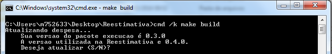

```{r setup, include=FALSE}
knitr::opts_chunk$set(echo = TRUE)
```

# Config

A construção do aplicativo começa com um teste de requisitos. O processo **munge**
depende de pacotes do R. Estes pacotes devem estar na versão especificada na
pasta *config/*. Se algum destes pacotes estiver em versão diferente da
necessária, o usuário terá a opção de atualizá-lo no decorrer do processo,
ou encerrar o processo e fazer a atualização manual do pacote. A função deste
teste é evitar que o processamento dos dados no **munge** deixe de funcionar
em razão de alterações não esperadas nos pacotes utilizados.

# Estrutura

Os testes de versão de pacotes é construído com dois arquivos:

* config/packageVersions
* R/packageVersions.R

O arquivo na pasta *config/* simplesmente discrimina a versão exigida dos 
pacotes no processo **munge**. Exemplo:

	data.table: 1.9.6
	execucao: 0.3.0
	readxl: 0.1.0
	relatorios: 0.2.9
	reest: 0.1.1

O script *R/packageVersions.R*, por sua vez, verifica a versão **instalada**
destes pacotes no computador que executa o processo. Se algum dos pacotes estiver
desatualizado, o script sugere a atualização ao usuário:

 

Se o usuário optar por não atualizar, o processo é encerrado. Se desejar 
atualizar, os pacotes mantidos pela DCGF serão atualizados utilizando o comando
*devtools::install_bitbucket()*, e os pacotes externos serão atualizados via
*install.packages()*.
